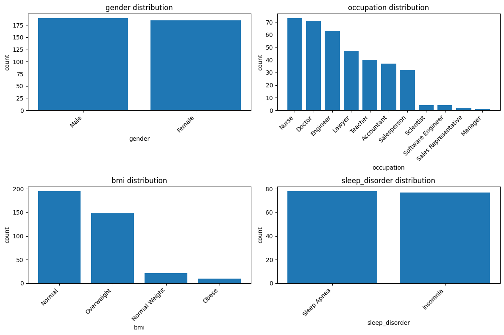
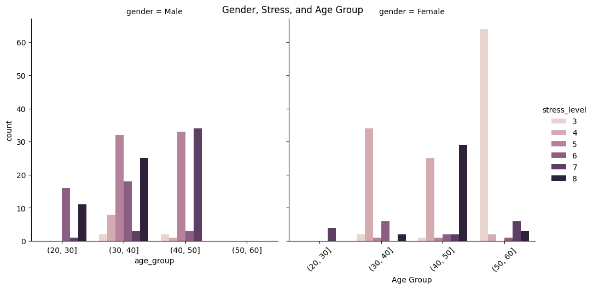
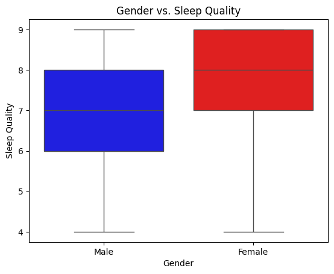
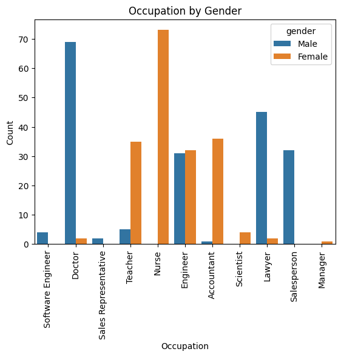
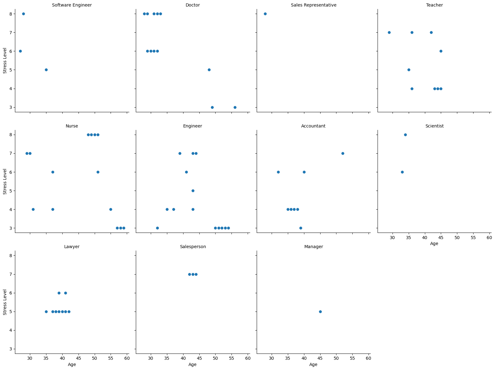

# Mental-Health-Risks
<h2>Visualize Data</h2>
<h3>Cathegories of interviewed:</h3>

    Dataset Overview:
    The Sleep Health and Lifestyle Dataset comprises 400 rows and 13 columns,
    covering a wide range of variables related to sleep and daily habits.
    It includes details such as gender, age, occupation, sleep duration,
    quality of sleep, physical activity level, stress levels,
    BMI category, blood pressure, heart rate, daily steps,
    and the presence or absence of sleep disorders.

<h2>Analyze Data</h2>
<h3>Stress level by age and gender:</h3>

<h3>Males:</h3>

    Men in their 20s feel under a lot of stress
    In their 30s dispersion of stress level is wider
    In their 40s they are pretty equal between normal and high level of stress

<h3>Females:</h3>

    As men, they are feel under pressure
    Much easier at their 30s
    Strong dividness between easiness and very high stress in their 40s
    Significally less stressed in their 50s
<h3>why Male have more stress:</h3>

__Hence females have better sleep quality than males, which could be reason why females are less stressed__

<h3>Stress level by profession</h3>

    - Doctors, Salespersons, Scientists and Sales Representatives feel more stressed
    - Nurses divided by 2 experience: their job very stressful or not stressful at all
    - Lawyers are somewhere in the middle. Their job is not that intense
    - Teachers and Accountants and Engineers are feel less stressful

<h3>Scatter plot to represents each proffesion by age and stress level:</h3>

    * With age doctors, teachers and engineers are less stressed
    * Accountants are more stressed with age
    * Nurses have different distribution, going down with age,
    raising at pick near 50 years and then significally go down.

<h2><b> Conclusion:</b></h2>

    First of all, the result doesn't mean that men have more stressful jobs than women.
    It can be explained, that male are feel that they are under more stress.
    It is might also mean, that men do not no or spend enough time for relaxations.
    Different industries and occupations have their own unique stressors.
    For example, jobs that involve high levels of responsibility, long working hours,
    and high-pressure decision-making, such as corporate leadership roles or certain
    healthcare professions, can be stressful regardless of gender. This results simply mean,
    that men should pay more attention to their stress level. Be aware of how they feel and
    spend more time to find healthy relaxation habits and care about quality of sleep. 

    Transition periods: Young people go through significant life transitions, such as moving from high school to college, entering the workforce, or starting independent living. These transitions can bring about new responsibilities, expectations, and challenges, which can lead to increased stress.

    Academic pressures: The academic demands placed on young people, such as exams, assignments, and expectations for achievement, can be a significant source of stress. The pressure to perform well academically, meet deadlines, and make important decisions about future career paths can contribute to high stress levels.

    Career uncertainty: Face uncertainty and pressure when it comes to career choices. The competitive job market, limited work experience, and the desire to find meaningful and fulfilling employment can all lead to increased stress.

    Financial concerns: Often face financial stress related to tuition fees, student loans, living expenses, and the transition to financial independence. These financial pressures can cause significant stress and anxiety.

    Health and self-care: While health concerns can increase with age, some prioritize their well-being and engage in self-care practices. Regular exercise, healthy eating, and appropriate medical care can contribute to better physical and mental health.